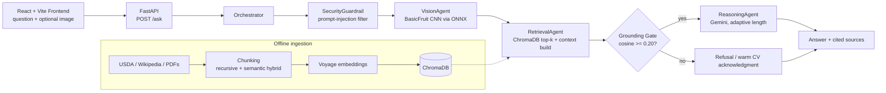

# Grocery AI

**A multimodal, grounding-first RAG assistant for nutrition and grocery knowledge — with a custom computer-vision front door for identifying produce from a photo.**

> Live demo: **https://grocery-ai-iota.vercel.app** · Backend API: **https://grocery-ai-xvs6.onrender.com** · Interactive docs: **https://grocery-ai-xvs6.onrender.com/docs**

---

## Overview

Generic LLM chatbots answer food and nutrition questions with fluent but unverifiable text. Grocery AI takes the opposite stance: **every answer must be grounded in a curated knowledge base** (USDA nutrition data, Wikipedia food articles, and food-science PDFs), and if the retrieved evidence doesn't support an answer, the system **refuses instead of hallucinating**.

A user can also upload a photo of produce. A custom-trained CNN classifies it (apple / banana / tomato), and the detection **anchors the retrieval query** — so "how long can I store *this*?" resolves to the right subject.

The project doubles as a build-then-compare learning roadmap: core RAG mechanics (chunking, embeddings, cosine scoring, prompt building, agent orchestration) are implemented directly rather than hidden behind a framework. Full internals are documented in [PROJECT_DOCUMENTATION.md](PROJECT_DOCUMENTATION.md).

**Main output:** a cited, strictly-grounded answer with the source chunks and their relevance scores, returned by a REST API and rendered in a chat UI.

## Key Features

- **Strict grounding gate** — retrieval scores are converted to true cosine similarity; if no chunk clears the relevance threshold (`0.20`), the assistant refuses rather than answering from world knowledge.
- **Multi-agent orchestration** — a supervisor coordinates guardrail, vision, retrieval, and reasoning agents per request.
- **Image → knowledge grounding** — a `BasicFruit` CNN classifies uploaded photos and injects the detection into the retrieval query (`"apple: <question>"`).
- **Adaptive answer length** — concise 1–3 sentence replies by default; full structured deep-dives (headings, tables, safety notes) only when the user explicitly asks for depth.
- **Source citations** — every grounded answer returns per-chunk article, section, source URL, and similarity score.
- **From-scratch chunking suite** — recursive, semantic (breakpoint-based), and hybrid strategies with deterministic IDs and deduplication.
- **Provider-isolated vector spaces** — Voyage (1024-dim) and local MiniLM (384-dim) embeddings never share a ChromaDB collection.
- **Free-tier-resilient ingestion** — batched, rate-limit-aware, **checkpointed/resumable** embedding ingestion.
- **Graceful CV degradation** — if no model/runtime is available, the RAG flow continues and explains what happened instead of failing.

## System Architecture



### Agent roles

| Agent | Responsibility | Type |
|---|---|---|
| `SecurityGuardrail` | Regex/pattern screening for prompt-injection attempts before anything runs | Deterministic |
| `VisionAgent` | Decodes base64 images, runs the CNN classifier, emits a `VisualObservation` (class, confidence, probabilities, model version) | Deep-learning inference |
| `RetrievalAgent` | Embeds the (CV-anchored) query, retrieves top-k chunks from ChromaDB with optional subject filter, assembles context | Embedding retrieval |
| Grounding Gate | Refuses any answer unsupported by evidence above the cosine threshold; acknowledges detected items warmly when the KB lacks data | Deterministic |
| `ReasoningAgent` | Builds a strictly-grounded, adaptive-length prompt and calls Gemini | LLM generation |

## Technical Approach

**Ingestion (offline).** Extractors pull from the USDA FoodData API, Wikipedia/food pages, and nutrition PDFs. Cleaners normalize everything into sectioned JSON records (`article`, `section`, `text`, relevance flags). A hybrid chunker (recursive split → semantic split within sections, then deduplicate) produces **~2,543 retrieval-ready chunks** validated against a `jsonschema`.

**Embeddings & storage.** The default embedder is **Voyage AI `voyage-4-lite`** (1024-dim, API-based — chosen so production fits Render's 512 MB free tier with no local model). A local `sentence-transformers` MiniLM (384-dim) remains as an automatic fallback, selected via `EMBEDDING_PROVIDER`. Each provider gets its own ChromaDB collection (`grocery_ai_voyage` / `grocery_ai`), so vector spaces never mix. Ingestion is batched, throttled, and resumable — a rate-limit abort continues where it left off.

**Retrieval & scoring.** ChromaDB's default distance is squared-L2. Because Voyage vectors are unit-normalized (`d² = 2 − 2·cos`), the retriever converts distance to **true cosine similarity**: `score = clamp(1 − d/2, 0, 1)`, making the grounding threshold meaningful.

**Generation.** Gemini (`google-genai`, flash-lite tier with automatic model fallback) generates the answer under two prompt modes — concise (default) and detailed (triggered by intent phrases like "in detail", "compare", "nutrition facts"). Both modes forbid outside knowledge and require answering only what was asked.

## Dataset & Knowledge Sources

| Source | Type | Processing |
|---|---|---|
| USDA FoodData API | Structured nutrition data (per-item JSON: almonds, apple, avocado, beef, …) | Extract → clean → sectioned records |
| Wikipedia / food pages | Long-form food & storage articles | HTML extraction → cleaning → semantic chunking |
| Nutrition PDFs (5 docs) | Guides on dairy, eggs, produce, storage | `pdf_to_text` → text cleaning → chunking |
| `cv/datasets/` (produce images) | ~28,200 images: Apple 11,028 train / 5,515 val / 5,492 test (30 subgroups); Tomato 2,768 / 1,386 / 1,375 (6 subgroups); Banana 323 / 163 / 161 | `ImageFolder` + 224×224 resize, no normalization |

## Model & AI Components

| Component | Implementation | I/O |
|---|---|---|
| `BasicFruit` CNN | Custom 4-conv-block PyTorch model (250,179 params), trained in [`mixed_classification.ipynb`](cv/notebooks/mixed_classification.ipynb) | RGB 224×224 → 3-class softmax (apple / banana / tomato) |
| CV runtime | **ONNX-first** (`basic_fruit.onnx` + `onnxruntime`, works on Render), PyTorch `.pth` fallback for dev; both share identical preprocessing | Lazy-loaded; never blocks boot |
| Embedding | Voyage `voyage-4-lite` (default), MiniLM local fallback | Text → 1024-d (384-d local) unit-normalized vectors |
| LLM | Gemini via `google-genai` with model-availability fallback chain | Grounded prompt → answer |
| Vector store | ChromaDB persistent client, provider-isolated collections | Query vector → top-k chunks + scores |

## Results & Evaluation

Reported by the committed training notebook (same data splits, 10 epochs):

- **Validation accuracy: 100.00% · Test accuracy: 100.00%** (final epoch train loss ≈ 0.008)

These numbers reflect the curated, visually consistent dataset and should be read as *within-dataset* performance — they are not a guarantee on unconstrained real-world photos. End-to-end validation instead comes from the test suite:

| Test | Covers |
|---|---|
| `tests/test_voyage_e2e.py` | Chunking → Voyage ingestion → retrieval on a throwaway collection |
| `tests/test_cv_e2e.py` | Image → CV classification → anchored retrieval → adaptive answer |
| `tests/test_deduplication.py` | Chunk deduplication correctness |
| `test_api_client.py` / `test_data_load*.py` | API and data-load smoke checks |

## Tech Stack

| Layer | Technologies |
|---|---|
| Languages | Python, TypeScript |
| Backend | FastAPI, Uvicorn, Pydantic |
| AI / RAG | Gemini (`google-genai`), Voyage AI embeddings, ChromaDB, LangChain SemanticChunker, `jsonschema` |
| Computer Vision | PyTorch / torchvision (training), ONNX + ONNX Runtime (inference), Pillow, NumPy |
| Frontend | React 19, Vite, Tailwind CSS, react-markdown |
| Deployment | Render (free tier) + Vercel, GitHub Actions keep-alive |

## Project Structure

```text
Grocery_AI/
├── backend/
│   ├── agents/           # orchestrator, guardrail, vision, retrieval, reasoning
│   ├── api/              # FastAPI app + request models
│   ├── rag/              # RAGPipeline wiring
│   ├── retrieval/        # ChromaDB retriever + context selection
│   ├── embedding/        # Voyage/local embedders, ingest, validation
│   ├── chunking/         # recursive, semantic, hybrid chunkers + factories
│   ├── vision/           # BasicFruit classifier (ONNX + PyTorch backends)
│   ├── prompt_builder/   # prompt + query contextualization
│   ├── llm/              # Gemini wrapper
│   ├── data_pipeline/    # USDA/wiki/PDF extractors, cleaners
│   └── data/             # cleaned corpus, chunks, ChromaDB vector_db
├── cv/
│   ├── datasets/         # Apple / Banana / Tomato image folders
│   └── notebooks/        # training notebooks + basic_fruit.pth / .onnx
├── frontend/             # React chat UI (components, hooks, types)
├── tests/                # e2e + smoke tests
└── PROJECT_DOCUMENTATION.md
```

## Installation & Setup

### 1. Clone

```bash
git clone <repo-url> && cd Grocery_AI
```

### 2. Backend

```bash
cd backend
python -m venv .venv
.venv\Scripts\activate          # Windows (macOS/Linux: source .venv/bin/activate)
pip install -r requirements.txt
```

Create `backend/.env`:

```env
GEMINI_API_KEY=your_gemini_api_key_here
VOYAGE_API_KEY=your_voyage_api_key_here
USDA_API_KEY=your_usda_api_key_here        # ingestion only
EMBEDDING_PROVIDER=voyage                  # "voyage" (default) or "local"
# Optional:
# VOYAGE_BATCH_SIZE=24                     # inputs per embedding call
# VOYAGE_BATCH_INTERVAL=60                 # seconds between calls (free tier: 3 req/min)
# CV_MODEL_PATH / CV_MODEL_ONNX_PATH       # override model file locations
# BACKEND_CORS_ORIGINS=...                 # extra allowed frontend origins
```

Start the API (the RAG stack initializes lazily on first request):

```bash
uvicorn api.app:app --reload
```

For CV inference with the PyTorch fallback, additionally install `torch`/`torchvision` in your dev environment (deliberately excluded from `requirements.txt` to fit Render's memory limit). The ONNX path needs no extra install — `basic_fruit.onnx` is committed.

### 3. Frontend

```bash
cd frontend
npm install
npm run dev
```

Create `frontend/.env` (or set it in Vercel):

```env
VITE_API_URL=http://127.0.0.1:8000   # or the Render URL for staging
```

### 4. Rebuild the knowledge base (optional)

```bash
python backend/chunking/v4_chunk_maker_voyage.py     # re-chunk
python backend/embedding/run_ingest_voyage.py        # resumable ingest (RESET_VOYAGE_DB=1 to wipe & rebuild)
```

## Usage

Interactive Swagger UI: **http://127.0.0.1:8000/docs** (or the deployed `/docs`).

| Method | Path | Description |
|---|---|---|
| GET | `/` | Welcome |
| GET | `/health` | Status, vector count, active collection, embedder, subjects |
| GET | `/subjects` | Knowledge-base subjects |
| POST | `/ask` | Main Q&A endpoint |

```bash
curl -X POST http://127.0.0.1:8000/ask \
  -H "Content-Type: application/json" \
  -d '{"question": "How long can I store this in the fridge?", "subject": "Apple"}'
```

Response shape:

```json
{
  "answer": "...",
  "sources": [{ "article": "Apple", "section": "Storage", "source": "...", "score": 0.62 }],
  "visual_observation": { "classification": "apple", "confidence": 1.0, "model_version": "v0.0.1 (trial)" },
  "grounded": true
}
```

In the web UI: pick a subject (or leave it general), type a question, or attach a produce photo — the answer renders with its cited sources and relevance scores.

## Deployment

- **Backend** — Render free tier (`grocery-ai-xvs6.onrender.com`). The ChromaDB `vector_db` is committed to the repo so the ephemeral free-tier filesystem reads it on boot — no runtime re-ingestion. CV runs there via **ONNX Runtime** (no PyTorch required).
- **Frontend** — Vercel (`grocery-ai-iota.vercel.app`), pointed at the Render API via `VITE_API_URL`; CORS is configured via `BACKEND_CORS_ORIGINS` with safe defaults in code.
- **Keep-alive** — a GitHub Actions workflow pings `/health` every 10 minutes to mitigate free-tier spin-downs (best-effort; the scheduler can occasionally delay).

## Limitations

- **CV scope** — 3 classes only (apple/banana/tomato); the 100% test accuracy is within a curated dataset, not real-world robustness. The classifier is versioned as a **v0.0.1 trial**.
- **Grounding trade-off** — the refusal-first design intentionally answers nothing outside the knowledge base; breadth is bounded by ingested sources.
- **Free-tier constraints** — Voyage's free key allows ~3 requests/min (mitigated by batching + resumable ingest); Render's free instance spins down when idle and the filesystem is ephemeral.
- **Guardrail is pattern-based** — the injection filter covers common string patterns, not adversarial semantics.
- **Retrieval is single-vector** — top-k dense retrieval without reranking or hybrid lexical search; subject filtering depends on clean metadata.

## Future Work

*Planned — not yet implemented:*

- Self-describing CV checkpoints (class names + architecture embedded in the weights file for true one-file model swaps) and additional produce classes, paired with knowledge-base coverage.
- Reranking / hybrid (BM25 + dense) retrieval for better precision.
- A structured SQL layer for tabular nutrition values (per-100g facts) alongside the vector store.
- Hosted vector database to replace the committed-file approach at scale.

## License

Released under the **MIT License** — free to use, modify, and build upon. The only requirement is that the copyright notice and attribution travel with any copy or substantial portion of this code.

If you use or extend this project, attribution is genuinely appreciated: mention **Grocery AI**, link back to this repository, and credit the author (see the LICENSE copyright line) — e.g. a tag on LinkedIn when sharing work built on it. It helps others find the project and supports the person maintaining it.
